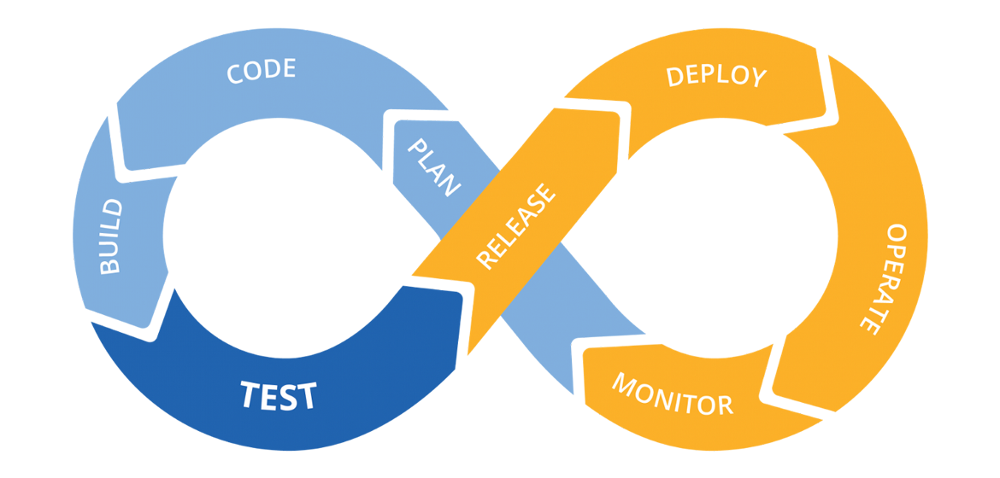

## What is CI/CD?

CI/CD, standing for **Continuous Integration** and **Continuous Delivery/Deployment**, is a DevOps practice that automates and streamlines the software development and deployment lifecycle.
