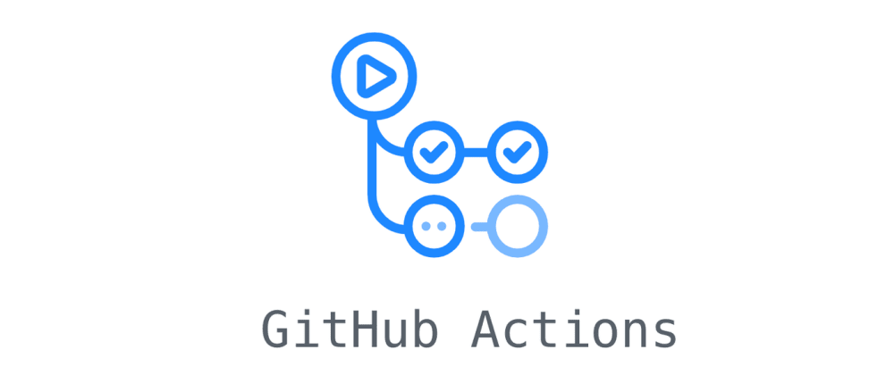

## What is CI/CD?

CI/CD, standing for **Continuous Integration** and **Continuous Delivery/Deployment**, is a DevOps practice that automates and streamlines the software development and deployment lifecycle.

✅ **Continuous Integration (CI)**
is the practice of automatically integrating code changes into a shared repository several times a day. Each integration is verified by automated tests to detect problems early.

Key Concepts:

- Automated tests, code scanning checks, build code, etc.
- Early bug detection.
- Integrate with other tools like SonarCube, Linter, etc.

🚀 **Continuous Delivery (CD)**
ensures that code is automatically prepared for a release to production. It builds on CI by automating the release process so that new changes can be deployed at any time with minimal effort.

Key Concepts:

- Automatic deployment to staging.
- Manual or automated release to production.
- Ensures deployment pipeline is always in a releasable state.

🔁 **Continuous Deployment**
is an advanced form of CD where every code change that passes all stages of your production pipeline is released to customers automatically, without human intervention.

 

## What is CI/CD Pipeline?

A continuous integration and continuous deployment (CI/CD) pipeline is a series of established steps that developers must follow in order to deliver a new version of software. CI/CD pipelines are a practice focused on improving software delivery throughout the software development life cycle via automation. [Sumber](https://www.redhat.com/en/topics/devops/what-cicd-pipeline)

 

# What is Github Actions?

GitHub Actions is a continuous integration and continuous delivery (CI/CD) platform that allows you to automate your build, test, and deployment pipeline. You can create workflows that build and test every pull request to your repository, or deploy merged pull requests to production. [Sumber](https://docs.github.com/en/actions/about-github-actions/understanding-github-actions)
